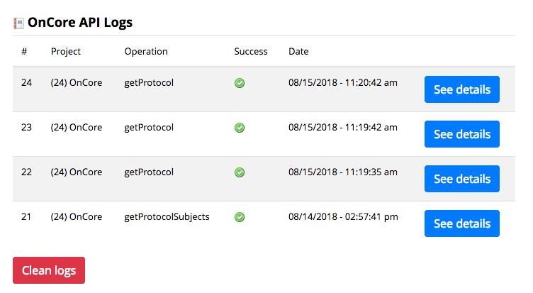
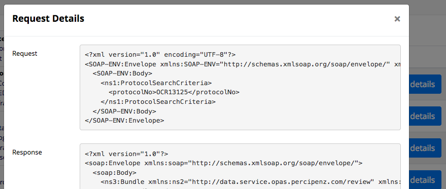

# REDCap OnCore Client
This is a REDCap external module that provides integration with OnCore SOAP API.

## Prerequisites
- REDCap >= ?? (awaiting for [this pull request](https://github.com/vanderbilt/redcap-external-modules/pull/74) to be reviewed, merged and released)
- [PHP SOAP](http://php.net/manual/en/book.soap.php)

## Installation
- Clone this repo into to `<redcap-root>/modules/redcap_oncore_client_v<version_number>`.
- Go to **Control Center > Manage External Modules** and enable OnCore Client.
- Go to your project home page, click on **Manage External Modules** link, and then enable OnCore Client.

## Configuration
Access **Manage External Modules** section of your project, click on OnCore Client's configure button, and fill the configuration form with your credentials.

- **WSDL**: The OnCore WSDL URL, e.g. `https://oncore-test.ahc.ufl.edu/opas/OpasService?wsdl`
- **Login**: Your OnCore client user ID
- **Passord**: Your OnCore client password
- **Clear logs after (days)**: The number of days that the API log entries should remain available on REDCap


## How to make API calls

Here is an example of an API request to get protocol information (`getProtocol`).

```php
<?php

$module = \ExternalModules\ExternalModules::getModuleInstance('redcap_oncore_client', 'v1.0');
$client = $module->getSoapClient();

$result = $client->request('getProtocol', array('protocolNo' => 'OCR20002'));
```

For more complex requests (like `createProtocol` or `registerNewSubjectToProtocol`), check the `requests_examples.txt` file, which contains input examples of valid requests. For additional sample code see the testing code in (PBC's REDCap Module)[https://github.com/pbchase/my_redcap_module/tree/redcap_oncore_client_test].

This module does not contain details or definitions about OnCore API services. So for further details you may read the WSDL file or web page that was provided to you - use a Desktop client like [SoapUI](https://www.soapui.org/) for that.

### Supported services
This module is still on construction so the supported operations so far are:

- `getProtocol`
- `getProtocolSubjects`
- `createProtocol`
- `registerNewSubjectToProtocol`
- `registerExistingSubjectToProtocol`

## Logs page
You may track your API calls by accessing the logs page. Go to your project page and click on **OnCore Logs** at the left menu.




Remember that in order to avoid storage problems, you can configure the lifetime of a log entry on the configuration page. There is a cron job that checks every day for expired log entries and remove them.
