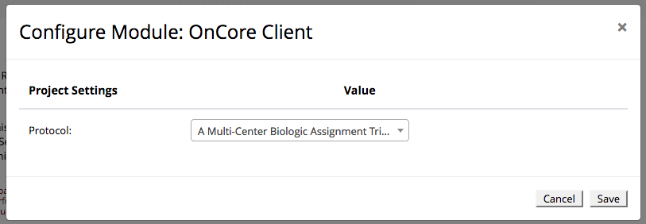

# REDCap OnCore Client
This is a REDCap external module that provides integration with OnCore.

It allows REDCap project builders to associate a REDCap project with an OnCore protocol. It also allows developers to call the OnCore API via SOAP.

## Prerequisites
- REDCap >= 8.7.0
- [PHP SOAP](http://php.net/manual/en/book.soap.php)

## Installation
- Clone this repo into to `<redcap-root>/modules/redcap_oncore_client_v<version_number>`.
- Go to **Control Center > External Modules** and enable OnCore Client.
- Go to your project home page, click on **External Modules** link, and then enable OnCore Client.

## Main Configuration
Go to **Control Center > External Modules**, click on OnCore Client's configure button, and fill the configuration form with your credentials.

- **WSDL**: The OnCore WSDL URL, e.g. `https://oncore-test.ahc.ufl.edu/opas/OpasService?wsdl`
- **Login**: Your OnCore client user ID
- **Passord**: Your OnCore client password
- **SIP URL**: The URL of OnCore SIP (Study Information Portal), e.g. `https://oncore-test.ahc.ufl.edu/sip/SIPMain` - this is required to associate projects with protocols
- **Log requests**: Check this field to log all API requests (see Logs Page section) - this is useful for development purposes and testing


## Associating a Project with a Protocol

If you already set a valid SIP URL, you may associate a project with a protocol.

To do that, access **External Modules** section of your project, make sure OnCore Client is enabled, and then click on its configure button.



## Sync OnCore subjects

TODO : write this section


## Using the API

Here is an example of an API request to get protocol information (`getProtocol`).

```php
<?php

$module = \ExternalModules\ExternalModules::getModuleInstance('redcap_oncore_client');
$client = $module->getSoapClient();

$result = $client->request('getProtocol', array('protocolNo' => 'OCR20002'));
```

For more complex requests (like `createProtocol` or `registerNewSubjectToProtocol`), check the `requests_examples.txt` file, which contains input examples of valid requests. For additional sample code see the testing code in [PBC's REDCap Module](https://github.com/pbchase/my_redcap_module/tree/redcap_oncore_client_test).

This module does not contain details or definitions about OnCore API services. So for further details you may read the WSDL file or web page that was provided to you - use a Desktop client like [SoapUI](https://www.soapui.org/) for that.

### Supported services
This module is still under construction so the supported operations so far are:

- `getProtocol`
- `getProtocolSubjects`
- `createProtocol`
- `registerNewSubjectToProtocol`
- `registerExistingSubjectToProtocol`

## Logs page
You may track your API calls by accessing the logs page. Go to **Control Center** and click on **OnCore Logs** at the left menu.


You may clear the logs by clicking on **Clean logs** button.
