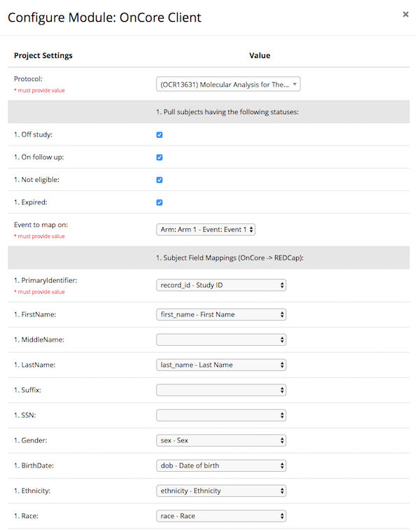
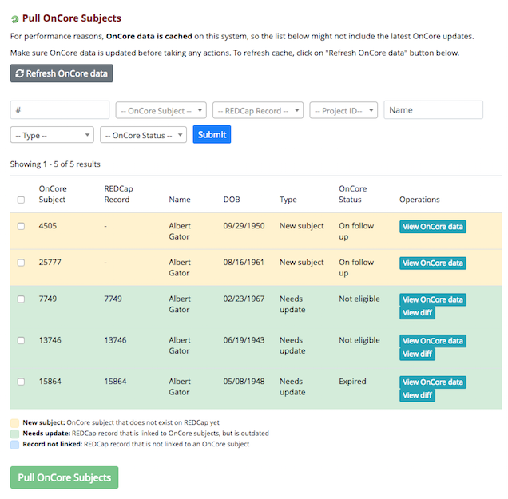
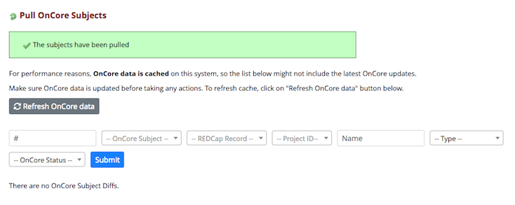

# REDCap OnCore Client
This is a REDCap external module that provides integration with OnCore.

It allows REDCap project builders to associate a REDCap project with an OnCore protocol. It also allows developers to call the OnCore API via SOAP.

## Prerequisites
- REDCap >= 8.7.0
- [PHP SOAP](http://php.net/manual/en/book.soap.php)
- [REDCap Entity](https://github.com/ctsit/redcap_entity) >= 2.1.0

## Installation
- Clone this repo into to `<redcap-root>/modules/redcap_oncore_client_v<version_number>`.
- Go to **Control Center > External Modules**, enable REDCap Entity, and then OnCore Client.
- Go to your project home page, click on **External Modules** link, and then enable OnCore Client.

## Main Configuration
Go to **Control Center > External Modules**, click on OnCore Client's configure button, and fill the configuration form with your credentials.

- **WSDL**: The OnCore WSDL URL, e.g. `https://oncore-test.ahc.ufl.edu/opas/OpasService?wsdl`
- **Login**: Your OnCore client user ID
- **Passord**: Your OnCore client password
- **SIP URL**: The URL of OnCore SIP (Study Information Portal), e.g. `https://oncore-test.ahc.ufl.edu/sip/SIPMain` - this is required to associate projects with protocols
- **Log requests**: Check this field to log all API requests (see Logs Page section) - this is useful for development purposes and testing

## Project level configuration

If you already set a valid SIP URL, you may associate a project with a protocol.

To do that, access **External Modules** section of your project, make sure OnCore Client is enabled, and then click on its configure button.

On this page you _must_ select a protocol, check at least one enrollment status, the event to map on and the REDCap field name where the OnCore PrimaryIdentifier will be stored. You have the option of mapping other OnCore demographic fields to REDCap fields as well.

Note that the REDCap fields must either be text fields or they must encode the data in *exactly* the same format as OnCore delivers the data. E.g., OnCode encode a gender of `female` as `F`. If you encode female as `Female` in your REDCap project, records with a gender of Female *will not sync*. They will quietly fail. We strongly recommend you configuring every field populated by the OnCore client as free text to prevent sync failures.

Note also that the OnCore client only supports longitudinal projects at this time. The event name _must_ be specified.

## Synch OnCore subjects

You can use the `Pull OnCore Subjects` feature to copy enrollees into REDCap from the OnCore enrollment records.

The same feature can update fields in REDCap that do not match the data in OnCore. The interface uses color queues to show which records subjects are only in OnCore (yellow), which records are in REDCap *and* Oncore but have mis-matched data (green) and which REDCap records are not linked to an OnCore subject (blue).

The data synchronization work has to be done on a regular basis by study staff as new subjects are enrolled. Make sure to press `Refresh OnCore data` at the beginning of a synch session. You can view the data relevant OnCore data for each record by pressing `View OnCore data` or see the difference between two records by pressing `View Diff`.

Select the records you want to synchronize, then press `Pull OnCore Subjects` bring those OnCore records and fields into REDCap. As you synchronize enrollees, they will disappear from the list. When the list is empty, your REDCap data is in synch with your OnCore data. 

### Supported services
This module is still under construction so the supported operations so far are:

- `getProtocol`
- `getProtocolSubjects`
- `createProtocol`
- `registerNewSubjectToProtocol`
- `registerExistingSubjectToProtocol`

## Logs page
You may track your API calls by accessing the logs page. Go to **Control Center** and click on **OnCore Logs** at the left menu.

You may clear the logs by clicking on **Clean logs** button.

## Developer notes

If you want extend the OnCore client to support other OnCore data types, you might find the [Developer's Notes](README-developer.md) helpful.
